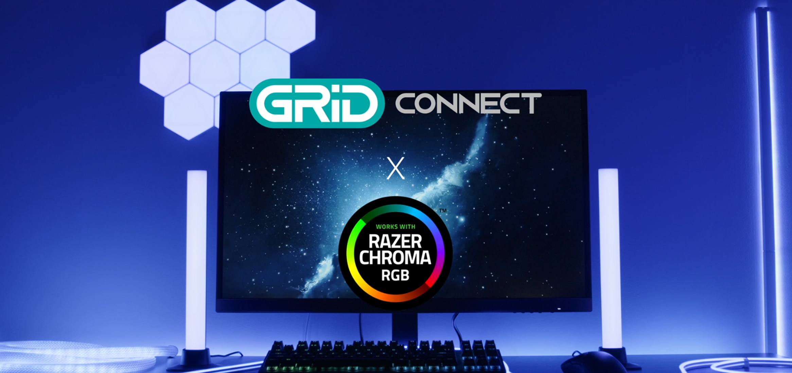

#  Grid Connect Desktop App 

Hello! \(^ヮ^)/	The Grid Connect Desktop App is a connector for enabling Chroma-compatible Grid Connect products to work with the Razer Chroma ecosystem. 
- For more information on [Razer Chroma](https://www.razer.com/au-en/chroma)
- For Grid Connect-related questions, [please go here](https://grid-connect.com.au/smart-home-support/)

### System Requirements:
- Windows 10 or 11
- Razer Synapse 4 (With Razer Chroma)
- Grid Connect Desktop App (v0.1.8 or higher)
- Stable internet connection (Chroma-compatible Grid Connect products require 2.4GHz Wifi)
- **Ensure that the Chroma-compatible Grid Connect products are on the same network as the PC**
- Any Chroma-compatible Grid Connect product listed here :white_check_mark::
  - CHR360HA: Hex Lights
  - CHR352HA: Bar Lights
  - CHR370HA: Neon Flex Strip
  - CHR351HA: Corner Light
  - CHR373HA: Rope Light
  - CHR381HA: 2m Strip Light
  - CHR382HA: 5m Strip Light
> [!IMPORTANT]
> A maximum of 10 Chroma-compatible Grid Connect products can be synced at any time (You can have more than 10 paired, but only 10 of them will sync)

## Installation Instructions:
1. Download and install Razer Synapse and Razer Chroma on your PC.
   - [Razer Synapse and Razer Chroma linked here](https://www.razer.com/au-en/chroma)
2. Download the latest release (.exe) of the Grid Connect Desktop App from the [Releases](https://github.com/gridconnect-official/RazerChroma/releases) section in this repository.
3. Install the Grid Connect Desktop App on your PC
> [!NOTE]
> If a 'Windows protected your PC' popup appears when installing, in that window, press 'More Info' and then 'Run Anyway'

### Enabling Razer Chroma function for Chroma-compatible Grid Connect products:
1. Pair your Chroma-compatible Grid Connect product to the Grid Connect mobile app on your phone, using the pairing instructions provided in the product's box.
   - [Google Play Store Link](https://play.google.com/store/apps/details?id=com.arlec.gridconnect&pcampaignid=web_share)
   - [Apple App Store Link](https://apps.apple.com/au/app/grid-connect/id1443698968)
2. Open the Grid Connect Desktop App on PC
3. Choose your region. (This region is determined by the location of the Grid Connect mobile account used to pair your Chroma-compatible Grid Connect products)
4. Scan the QR code displayed on the Grid Connect Desktop app using the Grid Connect mobile app's built in QR code scanner
   1. In the Grid Connect mobile app's main page, press the '+' (add device) button
   2. Press the '[-]' QR code scanner button
   3. Scan the QR code and follow the prompts
5. Once logged in, all Chroma-compatible Grid Connect products should appear in the device list.
6. Toggle the 'enable Razer Chroma' button or 'enable all devices' to select the Chroma-compatible Grid Connect products you want to enable Chroma sync.
7. Open the Razer Chroma app
8. Go to the 'Connect' tab
9. Enable 'Grid Connect' to enable Chroma for your Chroma-compatible Grid Connect products.
10. For how to use Razer Chroma functions, [please check out Razer's tutorials](https://mysupport.razer.com/app/answers/detail/a_id/13698)

## Troubleshooting:

